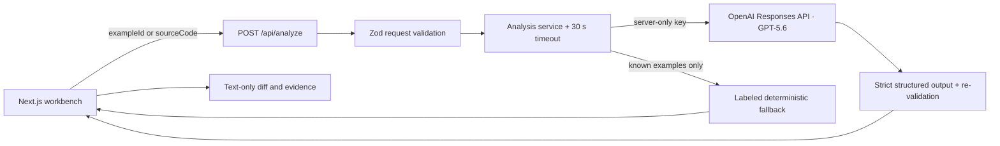

# StillMeaning

**Reduce motion, not meaning.**

StillMeaning is an AI-assisted motion accessibility workbench for frontend developers, design-system teams, accessibility engineers, and product designers. It analyzes what an animation communicates, identifies motion risk, and proposes a reduced-motion implementation that preserves progress, status, hierarchy, focus, and feedback.

Built for the Developer Tools track of OpenAI Build Week 2026.

## Live demo

The current Cloudflare Workers deployment is:

https://stillmeaning.alexliluz.workers.dev

The three curated examples remain usable if live GPT-5.6 is unavailable and always disclose fallback provenance. Some networks block the shared `workers.dev` domain; use the local setup below if the demo URL is unreachable.

## The problem

Web animation is often functional, not decorative. A moving progress bar communicates activity, a checkmark confirms an outcome, and a sliding panel explains hierarchy and context. A blanket `animation: none` rule may reduce discomfort while also deleting information.

[WCAG 2.3.3](https://www.w3.org/WAI/WCAG22/Understanding/animation-from-interactions) says interaction-triggered motion should be disableable unless it is essential to functionality or information. Apple’s [Reduced Motion evaluation criteria](https://developer.apple.com/help/app-store-connect/manage-app-accessibility/reduced-motion-evaluation-criteria) goes further: when motion conveys a status change or hierarchical transition, do not remove it entirely. StillMeaning turns that principle into a developer workflow.

## What the demo does

The stable golden path contains three curated cases:

1. **Upload progress** — replaces a continuous lateral shimmer with a static numeric progress state and `role="progressbar"`.
2. **Save confirmation** — replaces scale, rotation, and path-drawing motion with persistent outcome text and `role="status"`.
3. **Panel hierarchy** — replaces an `80vw` slide with a short opacity change, a named destination, and logical focus movement.

For each case, the workbench shows:

- detected technique, semantic role, risk, and evidence;
- the original and StillMeaning versions side by side;
- normal and reduced-motion modes;
- a bounded **Meaning Preserved** evidence checklist;
- an inspectable code diff and copy action;
- explicit provenance: `Live · GPT-5.6` or `Demo fallback`.

Developers can also paste HTML, CSS, JavaScript, or React source. Pasted source is sent as bounded, untrusted text for server-side analysis. Generated code is displayed but never executed.

## Architecture



Key modules:

- `src/domain/analysis.ts` — closed schemas and request limits.
- `src/domain/examples.ts` — three curated fixtures and deterministic fallback analyses.
- `src/server/analysis/` — safe prompt, provider boundary, timeout, validation, and fallback policy.
- `src/app/api/analyze/route.ts` — server-only API route.
- `src/components/previews/` — hand-authored previews; no model code execution.
- `src/components/code/` — source input, text diff, and clipboard feedback.

## GPT-5.6 integration

GPT-5.6 has a substantive role. It must infer semantic purpose, identify motion risk, select a safer strategy, generate replacement code, explain preserved meaning, and return validation evidence.

The provider uses the OpenAI Responses API with:

- `gpt-5.6` by default (`OPENAI_MODEL` can override it);
- `zodTextFormat` structured output;
- a strict Zod schema and a second application-side parse;
- low reasoning effort and a 6,000-token output ceiling;
- `store: false`;
- an abort signal and 30-second service timeout.

The model can never set its own provenance. The service overwrites `source` with `gpt-5.6` only after successful validation.

## Demo fallback disclosure

The three curated cases work without an API key using deterministic fixture data. The interface labels that data **Demo fallback** and states that it is not a live GPT-5.6 response.

Fallback is deliberately unavailable for arbitrary pasted source. If GPT-5.6 cannot run or produces invalid output, StillMeaning keeps the last valid result and shows an actionable error rather than fabricating an analysis.

## Security boundary

- `OPENAI_API_KEY` is read only on the server and `.env*` is Git-ignored.
- Requests accept either a known `exampleId` or at most 20,000 characters of source, never both.
- Prompts call source code untrusted data and prohibit executing, importing, fetching, or following instructions from it.
- Provider errors are normalized; response bodies, keys, and internal error details are not returned.
- Model output is schema-validated, rendered as text, and never evaluated, injected as HTML, or loaded into a preview.
- There is no URL fetcher in the MVP, avoiding an unnecessary SSRF boundary.

StillMeaning supplies review evidence, not WCAG certification. Generated code still requires developer review and user testing.

## Local setup

Requirements:

- Node.js 24+
- pnpm 11.9+
- a modern Chromium, Firefox, or WebKit browser

```bash
git clone https://github.com/alexliluz/stillmeaning.git
cd stillmeaning
pnpm install
cp .env.example .env.local
pnpm dev
```

Open [http://localhost:3000](http://localhost:3000).

To enable live analysis, add a Platform API key to `.env.local`:

```dotenv
OPENAI_API_KEY=your_platform_api_key
OPENAI_MODEL=gpt-5.6
```

Build Week Codex credits and OpenAI Platform API credits are separate. Codex credits do not pay for runtime GPT-5.6 API requests.

## Scripts

| Command | Purpose |
| --- | --- |
| `pnpm dev` | Start the local Next.js development server |
| `pnpm lint` | Run ESLint |
| `pnpm typecheck` | Run strict TypeScript checks |
| `pnpm test` | Run Vitest unit and component tests |
| `pnpm test:e2e` | Run desktop and mobile Playwright journeys |
| `pnpm build` | Build the production application |
| `pnpm start` | Run the production build |
| `pnpm build:cloudflare` | Build the Cloudflare Workers/OpenNext bundle |
| `pnpm preview:cloudflare` | Run the bundle locally in the Workers runtime |
| `pnpm deploy:cloudflare` | Deploy to the configured Cloudflare Worker |

The manual GitHub Actions workflow `Deployed GPT smoke` verifies the public homepage and makes one known-example request to the deployed API. It prints only provenance, notice, semantic role, and validation-count fields, and fails unless the response is visibly sourced from `gpt-5.6`.
| `pnpm cf-typegen` | Regenerate ignored Cloudflare runtime declarations |

## Cloudflare deployment

StillMeaning deploys as a Next.js 16 application on Cloudflare Workers through OpenNext. The Worker uses the Node.js compatibility layer, serves static assets through the `ASSETS` binding, and stores `OPENAI_API_KEY` only as a Cloudflare Secret.

After authenticating Wrangler, set the secret without putting it in shell history and deploy:

```bash
pnpm exec wrangler secret put OPENAI_API_KEY
pnpm deploy:cloudflare
```

The deployment command preserves dashboard variables and secrets. `.open-next`, `.wrangler`, generated runtime declarations, `.dev.vars`, and `.env` files are Git-ignored.

## Supported experience

- Responsive web UI tested at 1440×1000 and mobile Chromium dimensions.
- Keyboard navigation and visible focus states.
- OS `prefers-reduced-motion` plus an in-product comparison switch.
- Hand-authored previews for the three curated examples.
- Pasted source analysis when GPT-5.6 and outbound API access are available.

## Verification

The current release passes lint, strict type checking, 33 Vitest tests, a production build, and 8 Playwright tests across desktop and mobile Chromium. The same 8 browser tests pass against a local Cloudflare `workerd` preview. The browser suite covers all three cases, focus movement, keyboard order, clipboard feedback, custom-source bounds, and system reduced-motion behavior.

See [the verification record](docs/testing/2026-07-17-verification.md) for exact results and the honest live-API limitation observed in this development environment.

## How Codex contributed

This repository was developed primarily in one Codex session. Codex performed the initial empty-repository audit, feasibility and competitor research, architecture and design planning, test-driven implementation, dependency diagnosis, browser QA, accessibility and security review, and documentation preparation. The Git history preserves those stages.

Before the final Devpost submission, run `/feedback` in the primary Codex session and save the generated Codex Session ID. No Session ID is fabricated or recorded here in advance.

## Current limitations

- The MVP does not fetch or crawl external URLs.
- It does not execute arbitrary source or generated code, so custom-source before/after previews are intentionally disabled.
- Meaning checks validate bounded evidence in the generated result; they are not a complete accessibility audit.
- The deterministic fallback covers only the three curated cases.
- The shared `workers.dev` hostname may be blocked by some regional networks. StillMeaning intentionally uses the project-specific `stillmeaning.alexliluz.workers.dev` route without a custom domain; use the local setup when that shared domain is unavailable.

## Research and decisions

- [Feasibility, significance, and competitive landscape](docs/research/competitive-landscape.md)
- [Meaning-preservation boundary](docs/decisions/0001-meaning-preservation-boundary.md)
- [Generated-code safety boundary](docs/decisions/0002-generated-code-safety.md)
- [Approved workbench concept](docs/design/stillmeaning-workbench-concept.png)
- [Devpost Project Story draft](docs/submission/devpost-project-story.md)
- [Under-three-minute demo video script](docs/submission/demo-video-script.md)
- [Devpost readiness audit](docs/submission/readiness-audit.md)

## License

[MIT](LICENSE) © 2026 Alexander Lau.
